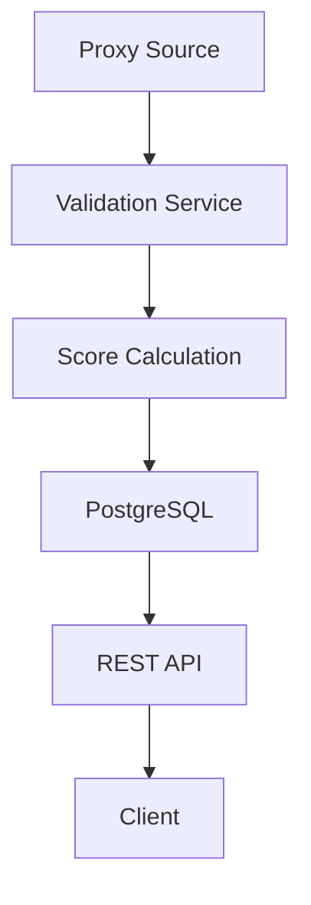

# Mtprototest

Backend service for validating, scoring, and ranking MTProxy servers for Telegram access.

The service continuously checks proxy availability, stores validation results, calculates reliability scores, and returns the most stable proxies via REST API.

---

## 🚀 Purpose

Public MTProxy servers are often unreliable:
- some stop working quickly
- some have high latency
- some accept connections but fail Telegram protocol

This project solves that by:

- validating proxies using real checks
- collecting historical results
- calculating reliability scores
- returning the best available proxies instead of random ones

---

## ⚙️ Tech Stack

- Java 17+
- Spring Boot
- Spring Data JPA
- PostgreSQL
- Docker / Docker Compose
- Gradle

*(add Kafka here if you реально используешь его)*

---

## 🧩 Features

- Proxy availability validation
- Proxy scoring and ranking
- Historical validation tracking
- REST API for retrieving top proxies
- Flexible filtering and sorting
- Foundation for feedback-based scoring

---

## 🏗 Architecture

The application follows a layered backend architecture:

- **Controller layer** — exposes REST endpoints
- **Service layer** — contains validation, scoring, and ranking logic
- **Repository layer** — handles persistence
- **Database layer** — stores proxies and validation history

Main domains:

- proxy management
- validation pipeline
- scoring system
- API layer

---

## 🔍 Validation Logic

Each proxy is validated using real connection checks.

Validation includes:

- connection success / failure
- response time (latency)
- stability over multiple checks

Timeouts and failures are handled explicitly to avoid blocking the validation pipeline.

---

## 📊 Scoring

Each proxy receives a score that reflects its reliability.

The score is based on:

- successful validation checks
- failed validation checks
- latency
- recent activity

This allows the system to return not just working proxies, but the most stable ones.

---

## ❗ Why not simple TCP check?

Simple TCP checks are not enough because:

- proxy may accept connection but fail Telegram protocol
- latency alone does not guarantee stability
- proxies degrade over time

This service uses repeated validation and scoring to provide more accurate results.

---

## ⚠️ Edge Cases

The system accounts for:

- unstable proxies (intermittent failures)
- high latency connections
- temporary network issues
- blocked or throttled proxies

---

## 🔌 Example API

### Get top proxies

`GET /api/proxies/top`

Example response:

```json
[
  {
    "id": 1,
    "host": "192.168.1.10",
    "port": 443,
    "secret": "abcdef123",
    "score": 87,
    "status": "WORKING"
  },
  {
    "id": 2,
    "host": "192.168.1.11",
    "port": 443,
    "secret": "xyz987654",
    "score": 79,
    "status": "WORKING"
  }
]
````

---

## 🔁 Simplified Flow



---

## ▶️ Running the Project

### Using Docker

```bash
docker-compose up --build
```

### Local run

```bash
./gradlew bootRun
```

Make sure PostgreSQL is configured properly before запуском.

---

## 🧪 Testing

* JUnit
* Mockito
* (add Testcontainers if using)

---

## 📈 Future Improvements

* improve scoring algorithm
* add caching layer
* add rate limiting
* add monitoring (metrics, logs)
* extend validation strategies
* add integration tests

---

## 🧠 Key Decisions

* Scoring instead of binary status (WORKING / NOT WORKING)
* Historical data over single check
* Backend-first architecture (focus on reliability and logic)
* Extensible validation approach

---

## 📌 Summary

This project focuses on building a reliable backend service that works with unstable external systems (proxies) and transforms raw checks into meaningful, ranked data.
